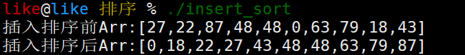

# 排序(插入、冒泡、归并、选择、快速)

1. 插入排序
2. 冒泡排序
3. 归并排序
4. 选择排序
5. 快速排序


# 1. 插入排序

​	插入排序（Insertion-Sort）的算法描述是一种简单直观的排序算法。它的工作原理是通过构建有序序列，对于未排序数据，**在已排序序列中从后向前扫描**，找到相应位置并插入。


## 1.1 算法描述

1. 从第一个元素开始，该元素可以认为已经被排序；
2. 取出下一个元素，在已经排序的元素序列中从后向前扫描；
3. 如果该元素（已排序）大于新元素，将该元素移到下一位置；
4. 重复步骤3，直到找到已排序的元素小于或者等于新元素的位置；
5. 将新元素插入到该位置后；
6. 重复步骤2~5。

​	**时间复杂度**：O(n^2^)


## 1.2 动图演示


## 1.3 算法代码

```c
void insert_sort(int *arr, int len) //插入排序
{
    for (int i = 1; i < len; i++)
    {
        for (int j = i; j > 0 && arr[j] < arr[j-1]; j--)
        {
            swap(arr[j], arr[j-1]);
        }
    }
    return ;
}
```


## 1.4 完整代码

```c
/*************************************************************************
	> File Name: insert_sort.c
	> Author: 
	> Mail: 
	> Created Time: Mon 14 Feb 2022 12:15:45 AM CST
 ************************************************************************/

#include <stdio.h>
#include <stdlib.h>
#include <time.h>

#define swap(a,b) {\
    __typeof(a) __tmp=a;\
    a=b;b=__tmp;\
}

void insert_sort(int *arr, int len) //插入排序
{
    for (int i = 1; i < len; i++)
    {
        for (int j = i; j > 0 && arr[j] < arr[j-1]; j--)
        {
            swap(arr[j], arr[j-1]);
        }
    }
    return ;
}

void showArr(int *arr, int len) //显示数组内容
{
    printf("Arr:[");
    for (int i = 0; i < len; i++)
    {
        i && printf(",");
        printf("%d", arr[i]);
    }
    printf("]\n");
}

int main()
{
    srand(time(0));

    #define ARRLEN 10

    int arr[ARRLEN] = {0};
    for (int i = 0; i < ARRLEN; i++) //生成随机数组
        arr[i] = rand() % 100;

    printf("插入排序前");
    showArr(arr, ARRLEN);

    insert_sort(arr, ARRLEN); //插入排序

    printf("插入排序后");
    showArr(arr, ARRLEN);

    #undef ARRLEN
    return 0;
}
```


## 1.5 演示截图




# 2. 冒泡排序

​	冒泡排序是一种简单的排序算法。它重复地走访过要排序的数列，一次比较两个元素，如果它们的顺序错误就把它们交换过来。走访数列的工作是重复地进行直到没有再需要交换，也就是说该数列已经排序完成。这个算法的名字由来是因为越小的元素会经由交换慢慢“浮”到数列的顶端。 


## 2.1 算法描述

1. 比较相邻的元素。如果第一个比第二个大，就交换它们两个；
2. 对每一对相邻元素作同样的工作，从开始第一对到结尾的最后一对，这样在最后的元素应该会是最大的数；
3. 针对所有的元素重复以上的步骤，除了最后一个；
4. 重复步骤1~3，直到排序完成。

​	**时间复杂度**：O(n^2^)


## 2.2 动图演示

/冒泡排序.gif)


## 2.3 算法代码

```c
void bubble_sort(int *arr, int len) //冒泡排序
{
    for (int i = 0; i < len - 1; i++)
    {
        for (int j = 0; j < len - 1 - i; j++)
        {
            if (arr[j] > arr[j+1])
                swap(arr[j], arr[j+1]);
        }
    }
    return ;
}
```


## 2.4 完整代码

```c
/*************************************************************************
	> File Name: bubble_sort.c
	> Author: 
	> Mail: 
	> Created Time: Mon 14 Feb 2022 12:15:45 AM CST
 ************************************************************************/

#include <stdio.h>
#include <stdlib.h>
#include <time.h>

#define swap(a,b) {\
    __typeof(a) __tmp=a;\
    a=b;b=__tmp;\
}

void bubble_sort(int *arr, int len) //冒泡排序
{
    for (int i = 0; i < len - 1; i++)
    {
        for (int j = 0; j < len - 1 - i; j++)
        {
            if (arr[j] > arr[j+1])
                swap(arr[j], arr[j+1]);
        }
    }
    return ;
}

void showArr(int *arr, int len) //显示数组内容
{
    printf("Arr:[");
    for (int i = 0; i < len; i++)
    {
        i && printf(",");
        printf("%d", arr[i]);
    }
    printf("]\n");
}

int main()
{
    srand(time(0));

    #define ARRLEN 10

    int arr[ARRLEN] = {0};
    for (int i = 0; i < ARRLEN; i++) //生成随机数组
        arr[i] = rand() % 100;

    printf("冒泡排序前");
    showArr(arr, ARRLEN);

    bubble_sort(arr, ARRLEN); //冒泡排序

    printf("冒泡排序后");
    showArr(arr, ARRLEN);

    #undef ARRLEN
    return 0;
}
```


## 2.5 演示截图

/image-20220214011825019.png)


# 3 归并排序