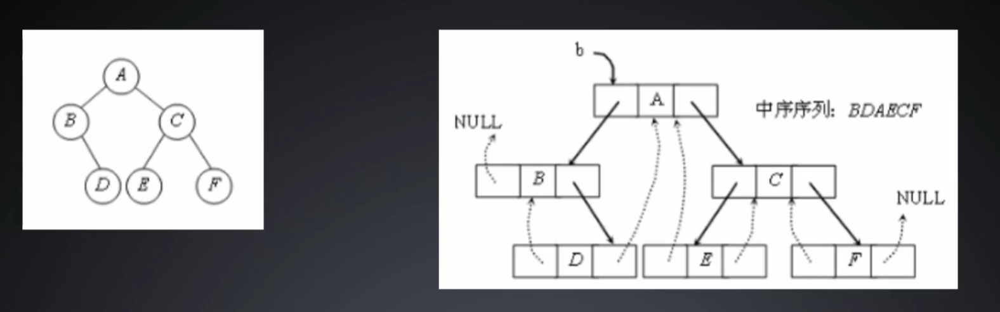

# 树与二叉树

1. 树的定义和相关概念
2. 二叉树的相关概念
3. 树的插入操作
4. 树的遍历
5. 树的广义表
6. 广义表建树


# 1. 树的定义和相关概念

树是n(n>=0)个节点的有限集合。

n=0时称为**空树**，树中没有任何节点。

n>0时必有一个特定节点，称作根节点，根节点下有0个以上的子节点，

各子节点也可成为**子树**，拥有自己的子节点。


根节点：树中没有父节点，称为根节点

叶节点或终端节点：树中没有子节点的节点，称为叶节点

非终端节点：除了叶节点以外的其他节点，称为非终端节点

父节点和子节点：节点的子树的根称为该节点的孩子，该节点称为孩子的父节点

兄弟节点：具有相同父节点的节点，互为兄弟

分支度：每个节点所拥有的子节点个数。树中最大的分支度值，为该树的分支度

阶层：阶层为节点特性，将根节点之阶层设为1其子节点为2，以此类推

高度或深度：一棵树中的最大阶层值，称为高度或深度

祖先：由某节点的根节点路径上的所有节点，均称为该节点的祖先。

树林：n>=0个树的集合称为树林，若将一树的根节点移去，所剩的恰是一树林


# 2. 二叉树的相关概念

二叉树是树的一种，二叉树中的节点**至多只能有两个**子节点。

1. 由n(n>=0)个节点所构成
2. 二叉树的根节点下可分成两个子树，称为**左子树**和**右子树**，左子树和右子树亦称二叉树


二叉树中，若所有的节点的左孩子均不存在，则称为**右歪斜树**，反之为**左歪斜树**。

二叉树中，若所有的叶子节点均在同一层且所有非叶子节点度数为2，则称为**满二叉树**。

二叉树中，若除掉最大阶层后为满二叉树，且最大阶层节点均向左靠齐，则称为**完全二叉树**。


性质1：在二叉树的第i层上最多有$2^{i-1}$个节点

性质2：深度为k的二叉树最多有$2^{k}-1$个节点

性质3：二叉树叶子节点个数为$n_0$，度数为2的节点个数为$n_2$，则$n_0=n_2+1$


# 3. 树的插入操作、遍历、广义表

```c
/*************************************************************************
	> File Name: tree.c
	> Author: 
	> Mail: 
	> Created Time: Mon 24 Jan 2022 03:59:42 AM CST
 ************************************************************************/

#include <stdio.h>
#include <stdlib.h>
#include <time.h>

typedef struct Node
{
    int val;
    struct Node *left;
    struct Node *right;
}Node;

typedef struct tree
{
    Node *root;
    int len;
}Tree;

Node *initNode(int val)
{
    Node *n = (Node *)malloc(sizeof(Node));
    n->val = val;
    n->left = NULL;
    n->right = NULL;
}

void freeNode(Node *n)
{
    if (!n)
        return ;
    free(n);
    return ;
}

Tree *initTree()
{
    Tree *t = (Tree *)malloc(sizeof(Tree));
    t->root = NULL;
    t->len = 0;
}

Node *insert(Node *root, int val)
{
    if (!root)
    {
        Node *n = initNode(val);
        return n;
    }

    if (val > root->val)                            //插入右子树
        root->right = insert(root->right, val);
    else                                            //插入左子树
        root->left = insert(root->left, val);

    return root;
}

void insertTree(Tree *t, int val)
{
    if (!t)
        return ;

    t->root = insert(t->root, val);
    t->len++;
    return ;
}

void preorderTrav(Node *root) //前序
{
    if (!root)
        return ;

    printf("%d,", root->val);
    preorderTrav(root->left);
    preorderTrav(root->right);
    return ;
}
void preorderTree(Tree *t)
{
    if (!t)
        return ;

    printf("Preo:[");
    preorderTrav(t->root);
    printf("]\n");
    return ;
}

void outputTable(Node *root) //输出广义表
{
    if (!root)
        return ;

    printf("%d", root->val);
    if (!root->left && !root->right)
        return ;
    printf("(");
    outputTable(root->left);
    printf(",");
    outputTable(root->right);
    printf(")");
    return ;
}
void outputTableTree(Tree *t)
{
    if (!t)
        return ;

    printf("Tabl:[");
    outputTable(t->root);
    printf("]\n");
    return ;
}

void inorderTrav(Node *root) //中序
{
    if (!root)
        return ;

    inorderTrav(root->left);
    printf("%d,", root->val);
    inorderTrav(root->right);
    return ;
}
void inorderTree(Tree *t)
{
    if (!t)
        return ;

    printf("Inor:[");
    inorderTrav(t->root);
    printf("]\n");
    return ;
}

void postorderTrav(Node *root) //后续
{
    if (!root)
        return ;

    postorderTrav(root->left);
    postorderTrav(root->right);
    printf("%d,", root->val);
    return ;
}
void postorderTree(Tree *t)
{
    if (!t)
        return ;

    printf("Post:[");
    postorderTrav(t->root);
    printf("]\n");
    return ;
}

void freeAll(Node *root)
{
    if (!root)
        return ;

    freeAll(root->left);
    freeAll(root->right);
    freeNode(root);
    return ;
}

void freeTree(Tree *t)
{
    if (!t)
        return ;

    freeAll(t->root);
    free(t);
    return ;
}

Node *findNode(Node *root, int val)
{
    if (!root)
        return NULL;

    if (val == root->val)
        return root;

    if (val > root->val)
        return findNode(root->right,val);
    else 
        return findNode(root->left, val);
}

Node *findTree(Tree *t, int val)
{
    if (!t)
        return NULL;

    return findNode(t->root, val);
}

int main()
{
    srand(time(0));
    Tree *t = initTree();
    int cnt = 10;
    int want = 0;
    while (cnt--)
    {
        int val = rand() % 100;
        insertTree(t, val);
        if (cnt == 9)
            want = val;
    }
    preorderTree(t);
    inorderTree(t);
    postorderTree(t);
    outputTableTree(t);

    Node *find = findTree(t, want);
    find?printf("find %d at %p, val=%d\n", want, find, find->val):printf("%d not found~\n", want);

    freeTree(t);
    return 0;
}
```


# 3. 广义表建树

广义表建树原理：

flag=左/右（记录当前应该插入左节点还是右节点）

1. 遇到数字就建立节点n，如果栈非空则将n插入栈顶节点的flag边
2. 遇到"（" 就将节点n压栈，并且将flag=左
3. 遇到"，"就将flag=右
4. 遇到"）"就出栈


```c
/*************************************************************************
	> File Name: table2tree.c
	> Author: 
	> Mail: 
	> Created Time: Mon 24 Jan 2022 03:59:42 AM CST
 ************************************************************************/

#include <stdio.h>
#include <stdlib.h>
#include <time.h>
#include <string.h>

typedef struct Node
{
    int val;
    struct Node *left;
    struct Node *right;
}Node;

typedef struct tree
{
    Node *root;
    int len;
}Tree;

Node *initNode(int val)
{
    Node *n = (Node *)malloc(sizeof(Node));
    n->val = val;
    n->left = NULL;
    n->right = NULL;
}

void freeNode(Node *n)
{
    if (!n)
        return ;
    free(n);
    return ;
}

Tree *initTree()
{
    Tree *t = (Tree *)malloc(sizeof(Tree));
    t->root = NULL;
    t->len = 0;
}

Node *insert(Node *root, int val)
{
    if (!root)
    {
        Node *n = initNode(val);
        return n;
    }

    if (val > root->val)                            //插入右子树
        root->right = insert(root->right, val);
    else                                            //插入左子树
        root->left = insert(root->left, val);

    return root;
}

void insertTree(Tree *t, int val)
{
    if (!t)
        return ;

    t->root = insert(t->root, val);
    t->len++;
    return ;
}

void preorderTrav(Node *root) //前序
{
    if (!root)
        return ;

    printf("%d,", root->val);
    preorderTrav(root->left);
    preorderTrav(root->right);
    return ;
}
void preorderTree(Tree *t)
{
    if (!t)
        return ;

    printf("Preo:[");
    preorderTrav(t->root);
    printf("]\n");
    return ;
}

void outputTable(Node *root) //输出广义表
{
    if (!root)
        return ;

    printf("%d", root->val);
    if (!root->left && !root->right)
        return ;
    printf("(");
    outputTable(root->left);
    printf(",");
    outputTable(root->right);
    printf(")");
    return ;
}
void outputTableTree(Tree *t)
{
    if (!t)
        return ;

    printf("Tabl:[");
    outputTable(t->root);
    printf("]\n");
    return ;
}

void inorderTrav(Node *root) //中序
{
    if (!root)
        return ;

    inorderTrav(root->left);
    printf("%d,", root->val);
    inorderTrav(root->right);
    return ;
}
void inorderTree(Tree *t)
{
    if (!t)
        return ;

    printf("Inor:[");
    inorderTrav(t->root);
    printf("]\n");
    return ;
}

void postorderTrav(Node *root) //后续
{
    if (!root)
        return ;

    postorderTrav(root->left);
    postorderTrav(root->right);
    printf("%d,", root->val);
    return ;
}
void postorderTree(Tree *t)
{
    if (!t)
        return ;

    printf("Post:[");
    postorderTrav(t->root);
    printf("]\n");
    return ;
}

void freeAll(Node *root)
{
    if (!root)
        return ;

    freeAll(root->left);
    freeAll(root->right);
    freeNode(root);
    return ;
}

void freeTree(Tree *t)
{
    if (!t)
        return ;

    freeAll(t->root);
    free(t);
    return ;
}

Node *findNode(Node *root, int val)
{
    if (!root)
        return NULL;

    if (val == root->val)
        return root;

    if (val > root->val)
        return findNode(root->right,val);
    else 
        return findNode(root->left, val);
}

Node *findTree(Tree *t, int val)
{
    if (!t)
        return NULL;

    return findNode(t->root, val);
}


//实现栈 数据元素类型Node*
typedef struct Stack
{
    Node **data;
    int size;
    int top;
}Stack;

Stack *initStack(int n)
{
    Stack *s = (Stack *)malloc(sizeof(Stack));
    s->data = (Node **)malloc(sizeof(Node *) * n);
    s->top = -1;
    s->size = n;
}

void freeStack(Stack *s)
{
    if (!s)
        return ;
    free(s->data);
    free(s);
    return ;
}

int push(Stack *s, Node *n)
{
    if (!s)
        return 0;
    if (s->top == s->size -1)
        return 0;

    s->data[++s->top] = n;
    return 1;
}

int isEmpty(Stack *s)
{
    return !(s && s->top != -1);
}

Node *pop(Stack *s)
{
    return s->data[s->top--];
}

Node *buildTree(char *str)
{
    Stack *s = initStack(strlen(str)/2);

    Node *root = NULL, *n = NULL;
    int flag = 0;
    int num = 0;

    while (*str)
    {
        switch (*str)
        {
            case '('://遇到左括号,把刚建立的节点压栈，作为后续操作的根
                push(s,n);
                flag = 0;
                break;
            case ',':
                flag = 1;
                break;
            case ')':
                root = pop(s);
                break;
            default:
            {
                if (*str < '0' || *str > '9')
                {
                    printf("Error,*str=%c\n", *str);
                    break;
                }
                //计算数字是多少？str2int
                num = 0;
                while (*str >= '0' && *str <= '9')
                {
                    num = num * 10 + *str - '0';
                    str++;
                }
                str--;
                n = initNode(num);
                //根据flag插入栈顶(根)的子树,flag=0左,flag=1右
                if (!isEmpty(s))
                    flag?(s->data[s->top]->right = n):(s->data[s->top]->left = n);
                break;
            }
        }
        str++;
    }

    freeStack(s);
    return root;
}

int main()
{
    Tree *t = initTree();
    char str[100];
    scanf("%s", str);
    t->root = buildTree(str);
    preorderTree(t);
    inorderTree(t);
    postorderTree(t);
    outputTableTree(t);
    freeTree(t);
    return 0;
}
```


# 4. 线索二叉树




```c
/*************************************************************************
	> File Name: threadTree.c
	> Author: 
	> Mail: 
	> Created Time: Wed 09 Feb 2022 08:29:21 PM CST
 ************************************************************************/

#include <stdio.h>
#include <stdlib.h>
#include <time.h>

#define CHILD 0
#define THREAD 1 

typedef struct Node
{
    int val;
    struct Node *left;
    struct Node *right;
    int ltag, rtag;
}Node;

Node *initNode(int val)
{
    Node *n = (Node *)malloc(sizeof(Node));
    n->val = val;
    n->left = NULL;
    n->right = NULL;
    n->ltag = n->rtag = CHILD;
}

void freeNode(Node *p)
{
    if (!p)
        return ;
    free(p);
    return ;
}

void insert(Node **raddr, int val)
{
    if (!(*raddr))
    {
        *raddr = initNode(val);
        return ;
    }

    if (val > (*raddr)->val)
        insert(&((*raddr)->right), val);
    else
        insert(&((*raddr)->left), val);

    return ;
}

void freeAll(Node *root)
{
    if (!root)
        return ;

    if (root->ltag == CHILD)
        freeAll(root->left);
    if (root->rtag == CHILD)
        freeAll(root->right);
    freeNode(root);
    return ;
}

void inorderTrav(Node *root)
{
    if (!root)
        return ;

    if (root->ltag == CHILD)
        inorderTrav(root->left);
    printf("%d ", root->val);
    if (root->rtag == CHILD)
        inorderTrav(root->right);
}

Node *pre = NULL;

//构建线索二叉树
void buildThread(Node *root)
{
    if (!root)
        return ;

    //先构建左子树的线索
    buildThread(root->left);

    //再构建根的线索
    //如果当前的左指针，让左指针指向前驱
    if (!root->left)
    {
        root->left = pre;
        root->ltag = THREAD;
    }

    if (pre && !pre->right)
    {
        pre->right = root;
        pre->rtag = THREAD;
    }

    pre = root;

    //最后构建右子树的线索
    buildThread(root->right);

    return ;
}

//找到树最左边的节点
Node *getLeftMost(Node *p)
{
    while (p && p->ltag == CHILD && p->left)
        p = p->left;

    return p;
}

//输出线索二叉树
void output(Node *root)
{
    if (!root)
        return ;

    Node *p = getLeftMost(root);
    while (p)
    {
        printf("%d ", p->val);
        if (p->rtag == CHILD)
            p = getLeftMost(p->right);
        else
            p = p->right;
    }
    return;
}

int main()
{
    srand(time(0));

    Node *root = NULL;

    int cnt = 10;
    while (cnt--)
    {
        int val = rand() % 100;
        insert(&root, val);
        printf("%d ", val);
    }
    putchar(10); //换行
    inorderTrav(root);
    putchar(10);

    buildThread(root);

    output(root);
    putchar(10);

    freeAll(root);
    return 0;
}
```

